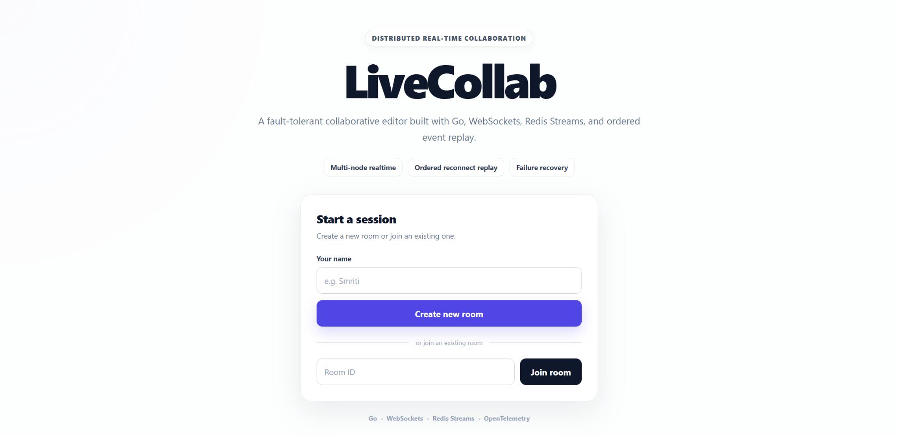
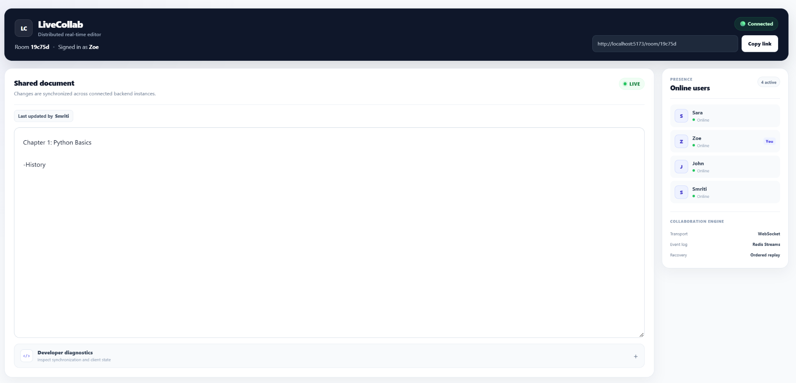
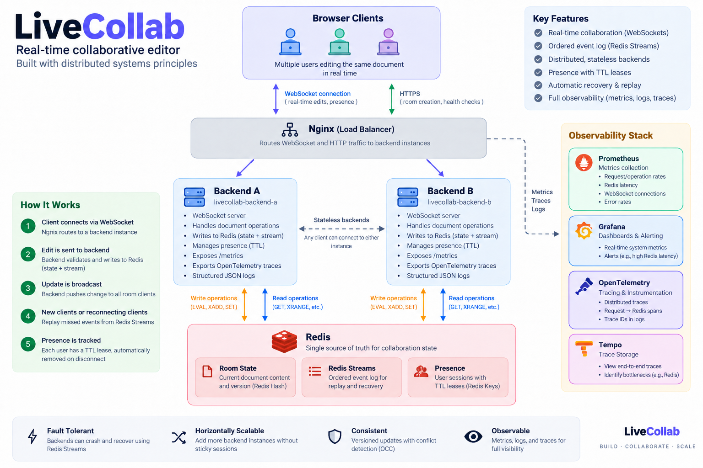
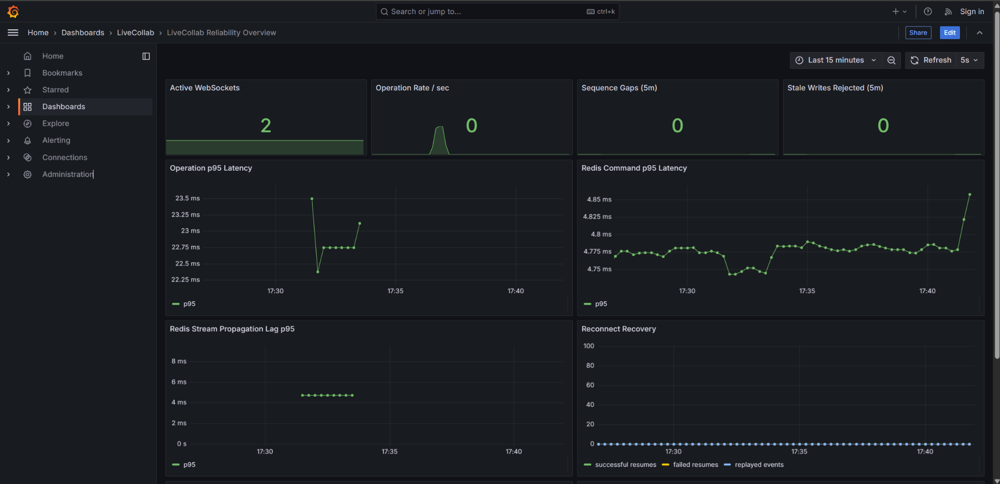
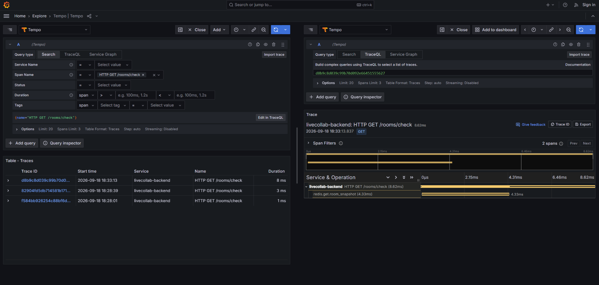
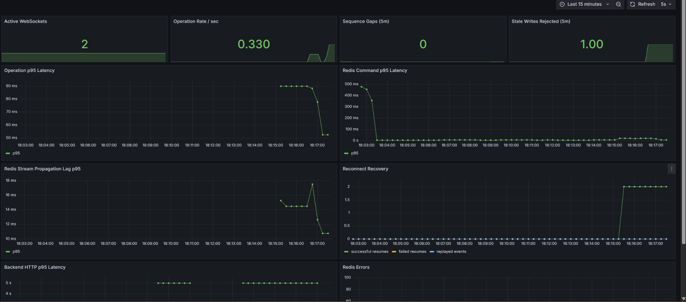
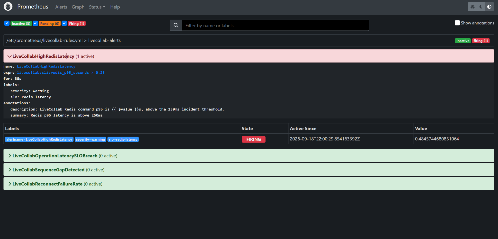

# LiveCollab

**A fault-tolerant, multi-node real-time collaborative editor built with Go, React, WebSockets, Redis Streams, and production-style observability.**

LiveCollab is a distributed-systems portfolio project focused on the problems that appear after a real-time editor grows beyond a single WebSocket server: cross-node fan-out, optimistic concurrency, reconnect replay, presence across backend instances, stale connection cleanup, failure recovery, and incident diagnosis.

<p align="center">
  <strong>Go</strong> · <strong>React + TypeScript</strong> · <strong>WebSockets</strong> · <strong>Redis Streams</strong> · <strong>Nginx</strong> · <strong>Prometheus</strong> · <strong>Grafana</strong> · <strong>OpenTelemetry</strong> · <strong>Tempo</strong>
</p>



## Why this project exists

A basic collaborative editor can work with one server and a WebSocket connection. LiveCollab intentionally goes further and asks:

- What happens when two users connect to different backend instances?
- How do edits stay ordered across nodes?
- How does a reconnecting client recover events it missed?
- How do stale writes avoid silently overwriting newer state?
- How does presence stay correct when clients move between backends?
- How are crashed or abandoned connections removed from presence?
- How can latency and correctness problems be detected and explained?

The result is a small distributed collaboration system with explicit correctness tests and an observability stack that can be exercised through controlled failures.

## Product preview

Multiple users can join the same room, edit the shared document, see global presence, and reconnect without depending on process-local document state.



The room UI exposes connection health and presence while keeping low-level synchronization details out of the main editing experience. A developer diagnostics drawer can surface server version, event sequence, participant count, and client identity when debugging or demonstrating the system.

## Architecture



### Request and event flow

1. Browser clients connect through Nginx using HTTP and WebSockets.
2. Nginx routes connections across multiple Go backend instances.
3. A backend validates an edit against the client's `baseVersion`.
4. Redis atomically updates room state and allocates the next event/version sequence.
5. The accepted edit is appended to a Redis Stream.
6. Every backend independently consumes the shared stream and forwards events to its locally connected clients.
7. Reconnecting clients provide their last observed sequence and replay missed events before switching back to live delivery.

The backends are designed so collaboration correctness does not depend on a client reconnecting to the same process.

## Core distributed-systems features

### Multi-node real-time collaboration

LiveCollab runs two Go backend instances locally behind Nginx. Users connected to different instances still observe the same document updates because Redis Streams provide the distributed event path.

The local two-node topology is the smallest setup that proves cross-node behavior. Additional backend instances can use the same Redis-backed state and event log.

### Optimistic concurrency control

Each client edit carries a `baseVersion`. The backend compares that version with the authoritative room version before accepting the operation.

With the configured stale-write policy, an edit based on an outdated document version is rejected instead of silently overwriting acknowledged state.

This makes stale writes observable and testable rather than treating last-write-wins behavior as correctness.

### Ordered Redis Stream event log

Redis stores both current room state and the ordered collaboration history used for recovery.

Accepted updates receive monotonic version/sequence numbers and are appended to the room's Redis Stream. Backend instances independently read that stream, which allows a write entering through one backend to reach clients connected through another.

### Replay-to-live reconnect handoff

Reconnect recovery uses the client's last observed sequence as a resume cursor.

The replay implementation captures a fixed upper boundary, paginates the Redis Stream through that boundary, buffers live events that arrive during replay, removes overlap/duplicates, and then atomically switches the client to live delivery.

This protects against a subtle race where a new live event could otherwise arrive before an older replay event.

### Distributed presence with leases

Presence is stored globally in Redis rather than derived only from each backend's local WebSocket list.

Each accepted WebSocket receives a unique connection identity. Redis tracks participant metadata, a monotonic presence revision, and lease expiry. Independent backend consumers observe presence changes so users see the same participant list regardless of which backend they are connected to.

Heartbeats renew leases only for existing, unexpired memberships. Graceful disconnects remove the exact connection immediately, while crashed or abandoned connections disappear after lease expiry.

## Correctness validation

LiveCollab includes deterministic correctness scenarios rather than relying only on manual UI testing.

The reconnect/restart scenario validates that:

- cross-node fan-out works;
- reconnect replay has zero event gaps;
- replay does not contain duplicate events;
- replay order is monotonic;
- clients converge after a backend restart;
- stale operations cannot silently overwrite newer acknowledged state.

A representative recovery flow is:

```text
Alice -> backend-a
Bob   -> backend-b

Bob observes event 1.
Bob disconnects.
Alice commits events 2, 3, 4, 5.
backend-a is restarted.
Bob reconnects with resume cursor 1.
Bob replays 2 -> 3 -> 4 -> 5.
Bob converges to the Redis-backed state.
```

Run the backend and correctness suites with:

```powershell
npm run test:backend
npm run test:phase1
npm run test:phase2
```

Or run the combined verification command:

```powershell
npm run verify
```

The project also contains focused Go tests for replay/live ordering, pagination, missing history, distributed presence, identical usernames, stale presence snapshots, graceful disconnects, and lease expiration.

## Observability

LiveCollab uses metrics, traces, and structured logs together so a failure can be detected and then traced to a specific dependency or operation.

### Metrics and dashboards

Each backend exposes Prometheus metrics for signals including:

- active WebSocket connections;
- operation throughput and failures;
- operation p95 latency;
- Redis command p95 latency;
- Redis Stream propagation lag;
- reconnect attempts and successful/failed resumes;
- replayed event counts;
- sequence gaps;
- stale write rejections;
- Redis errors.

Grafana provisions a `LiveCollab Reliability Overview` dashboard automatically.



### Tracing and log correlation

Backends export OTLP traces through the OpenTelemetry Collector to Tempo. Operation traces include spans such as:

```text
livecollab.document.operation
└── redis.eval.apply_operation
```

HTTP room checks are also traced with a Redis child span:

```text
HTTP GET /rooms/check
└── redis.get.room_snapshot
```



Structured JSON logs contain correlation fields such as `traceId`, `spanId`, `operationId`, `roomId`, event sequence, server version, and duration. This allows a trace in Tempo to be matched to the corresponding backend log records.

Example:

```json
{
  "event": "operation_completed",
  "instanceId": "backend-b",
  "traceId": "...",
  "operationId": "...",
  "roomId": "...",
  "eventSequence": 42,
  "serverVersion": 42,
  "durationMs": 7.1
}
```

## Controlled Redis latency incident

The local Docker environment includes a debug-only fault-injection hook for Redis latency.

Run:

```powershell
powershell -ExecutionPolicy Bypass -File .\scripts\phase3-incident.ps1
```

The incident script:

1. injects artificial Redis latency into both backend instances;
2. generates Redis-backed room traffic;
3. keeps the fault active long enough for alert evaluation;
4. removes the fault and lets the system recover.

During the test, Redis p95 rises sharply in Grafana:



Prometheus then transitions the Redis latency alert to `FIRING`:



The same incident can be investigated in Tempo and JSON logs using trace IDs, which creates an end-to-end debugging path:

```text
Redis latency injected
        ↓
Prometheus metric rises
        ↓
Grafana shows the latency spike
        ↓
LiveCollabHighRedisLatency fires
        ↓
Tempo identifies the slow request / Redis span
        ↓
JSON logs provide operation-level details
        ↓
fault removed and metrics recover
```

The SLO thresholds in this repository are portfolio/demo objectives used to exercise the monitoring system; they are not claims based on production traffic.

## Local development

### Requirements

- Docker + Docker Compose
- Go 1.23+
- Node.js 22+

### Start the backend and observability stack

From the repository root:

```powershell
docker compose up --build -d
```

Or use the Phase 3 helper:

```powershell
powershell -ExecutionPolicy Bypass -File .\scripts\start-phase3.ps1
```

### Start the React frontend

```powershell
cd frontend
npm install
npm run dev
```

Then open the Vite URL, normally:

```text
http://localhost:5173
```

### Local service endpoints

| Service | URL |
| --- | --- |
| Nginx gateway | `http://localhost:8080` |
| Backend A | `http://localhost:8081` |
| Backend B | `http://localhost:8082` |
| Grafana | `http://localhost:3000` |
| Prometheus | `http://localhost:9090` |
| Tempo API | `http://localhost:3200` |

## Project structure

```text
LiveCollab/
├── backend/                  Go WebSocket server, Redis integration, presence, telemetry
├── frontend/                 React + TypeScript UI
├── correctness-tests/        Distributed correctness scenarios
├── docs/                     Architecture and engineering notes
├── infra/
│   ├── nginx.conf            Local load balancing
│   ├── prometheus/           Prometheus scrape + alert rules
│   ├── grafana/              Provisioned dashboard/data sources
│   ├── otel/                 OpenTelemetry Collector config
│   └── tempo/                Tempo configuration
├── scripts/
│   ├── phase3-incident.ps1
│   ├── test-phase3-metrics.ps1
│   └── ...
├── docker-compose.yml
└── README.md
```

## Engineering decisions

### Why Redis Streams?

The system needs more than shared current state. Reconnecting clients need an ordered history that can be replayed, and every backend needs a common event source for cross-node fan-out. Redis Streams provide both ordering and replay without introducing a second messaging system into the local architecture.

### Why not keep presence only in backend memory?

That works only while every participant happens to share the same process. Once clients are distributed across backend instances, local presence lists diverge. Redis-backed presence with revisions and leases keeps membership global and allows stale connections to expire after hard crashes.

### Why explicit replay boundaries?

Reading "everything after sequence N" while live events continue to arrive can mix replay and live delivery. Capturing a fixed replay boundary makes the recovery interval finite and lets the server perform a controlled replay-to-live handoff.

### Why instrument correctness signals?

CPU and memory can look healthy while a collaborative client has missed an event. Metrics such as sequence gaps, replay failures, stale-write rejections, and replay volume expose user-visible correctness properties alongside infrastructure health.

## Cloud deployment direction

The local topology is intentionally close to a cloud deployment model:

```text
Internet
   ↓
Application Load Balancer
   ↓
ECS Fargate tasks (multiple Go backend instances)
   ↓
ElastiCache for Redis
```

A production-oriented AWS version can add:

- Amazon ECR for container images;
- ECS Fargate services across private subnets;
- an internet-facing ALB;
- ElastiCache Redis in private subnets;
- IAM roles and security groups;
- ECS service autoscaling;
- CloudWatch integration where appropriate;
- Terraform for reproducible infrastructure.

The application protocol is designed so adding backend instances does not require changing document consistency, replay, or distributed presence semantics.

## What I learned

LiveCollab started as a real-time editor and evolved into an exercise in distributed correctness. The most useful engineering work was not simply opening WebSockets; it was handling the boundaries between nodes and failure states:

- distinguishing serialized network writes from logically ordered event delivery;
- designing an atomic replay-to-live handoff;
- separating process-local sockets from globally distributed presence;
- using leases to recover from hard crashes;
- turning correctness properties into automated tests and operational metrics;
- correlating metrics, traces, and structured logs during a controlled incident.

Those are the parts of the project that make it more than a CRUD or WebSocket demo.

## Additional documentation

- [`docs/phase1.md`](docs/phase1.md) — concurrency / stale-write correctness work
- [`docs/phase2.md`](docs/phase2.md) — reconnect and replay correctness
- [`docs/phase3.md`](docs/phase3.md) — observability architecture and incident testing
- [`docs/presence-leases.md`](docs/presence-leases.md) — distributed presence and stale-connection cleanup

## License

ISC
